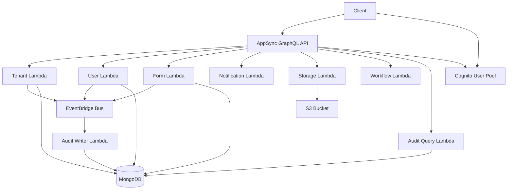
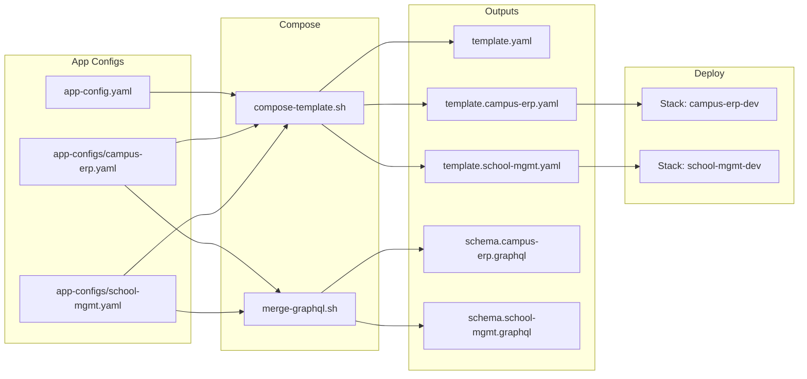
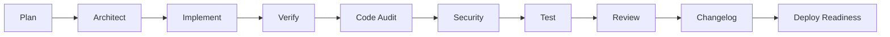

# Architecture

## Overview

General-purpose AWS SAM backend with modular verticals. Each vertical (tenant, user, form, notification, storage, workflow, audit) is a separate module with its own Lambda(s), AppSync data source, and GraphQL surface. Modules communicate via EventBridge.

## High-Level Diagram

## Core vs App Modules

- **Core modules** live in `src/core-modules/` and ship with the starter (tenant, user, form, notification, storage, workflow, audit). They are reused across products.
- **App modules** live in `src/app-modules/` and are product-specific (e.g. admission, fee-billing, library). Create them with `./scripts/generate-module.sh <name> --type app`.
- **Boundary**: App modules must never import from other app modules; they communicate only via EventBridge. Core modules never depend on app modules. See `.cursor/rules/app-module-isolation.mdc`.

## Template Composition

The SAM template is composed from fragments so you can enable only the modules you need:

- **Single-app (default):** `app-config.yaml` lists which core and app modules are included. `./scripts/compose-template.sh` produces `template.yaml`.
- **Multi-app:** Each app has a config in `app-configs/<app-name>.yaml`. Run `compose-template.sh --app <app-name>` to produce `template.<app-name>.yaml`. Each app deploys as a separate CloudFormation stack (e.g. `campus-erp-dev`, `school-mgmt-dev`), so you get independent deploy/rollback and no shared-resource bottlenecks.

`stacks/infrastructure.yaml` + enabled `stacks/core/*.yaml` + enabled `stacks/app/*.yaml` are concatenated. The GraphQL schema is **inlined** into the template from `schema.graphql` (default) or `schema.<app>.graphql` (per-app) so CloudFormation always updates the AppSync API when the schema changes. Run `./scripts/merge-graphql.sh` [--app &lt;app&gt;] first, then `npm run compose-template` or `npm run build` before `sam build`. For one app: `APP=<app> npm run build:app`.

## Multi-App Architecture

When using multiple apps (e.g. Campus ERP, School Management), each app has its own config and composed template:

- **Bootstrap:** `./scripts/init-app.sh <app-name> [--core ...] [--app ...]` creates `app-configs/<app>.yaml` and a `samconfig.toml` deploy profile.
- **Build:** `APP=<app> npm run build:app` or `./scripts/build-app.sh <app>`.
- **Deploy:** `sam deploy --config-env <app>`.

## Module Dependency Order

1. **Common layer** – middleware, db abstraction, utils
2. **Tenant** – foundation; all other modules scope by tenant_id
3. **User** – depends on Tenant; Cognito triggers
4. **Audit** – consumes all events; no dependencies
5. **Notification, Storage, Form** – depend on Tenant (and User for permissions)
6. **Workflow** – can trigger on any module event
7. **App modules** – depend on core modules; order per product

## Event Catalog (EventBridge)

| Source | DetailType | When |
|--------|------------|------|
| {ProjectName}.tenant-management | TenantCreated | After createTenant |
| {ProjectName}.tenant-management | TenantUpdated | After updateTenant |
| {ProjectName}.tenant-management | TenantSuspended | After suspendTenant |
| {ProjectName}.user-management | UserCreated | Post-confirmation |
| {ProjectName}.user-management | UserInvited | After inviteUser |
| {ProjectName}.user-management | UserDeactivated | After deactivateUser |
| {ProjectName}.user-management | RoleAssigned | After assignRole |
| {ProjectName}.form-management | FormPublished | After publishForm |
| {ProjectName}.form-management | FormSubmitted | After submitForm |

All events with source prefix `{ProjectName}.` are consumed by the Audit Writer and written to the audit log.

## Conventions

- **Multi-tenancy**: Shared database; every document has `tenant_id`. Enforced by BaseRepository and middleware.
- **Auth**: Cognito; custom claims `custom:tenant_id`, `custom:roles`, `custom:permissions` injected by PreTokenGeneration.
- **RBAC**: Permission format `module:resource:action` (e.g. `form:definition:create`). Checked by auth-guard before each operation.

## Agent Pipeline

Development is orchestrated by a multi-agent pipeline. Two modes:

- **Full pipeline** (for features, new modules): Plan → Architect → Implement (vertical agents in dependency order) → Verify (Event Contract + Dependency) → Code Audit → Security → Test → Review → Changelog → Deploy Readiness. Each phase is gated (user approval before next).
- **Lightweight** (for fixes, tweaks): Code Audit → Test → Changelog.

Vertical agents (one per module) run in dependency order: tenant (1st) → user (2nd) → form, notification, storage (3rd–5th) → workflow (6th) → audit (7th, last — consumes all events).

See [docs/agents/REGISTRY.md](docs/agents/REGISTRY.md) for the full agent list. Orchestration details: `.cursor/rules/agent-pipeline.mdc`.

